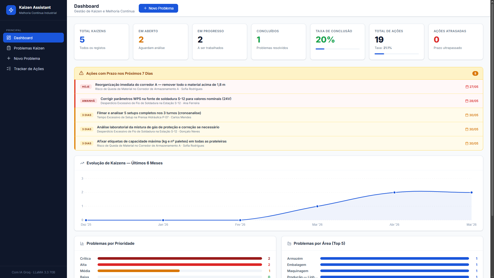
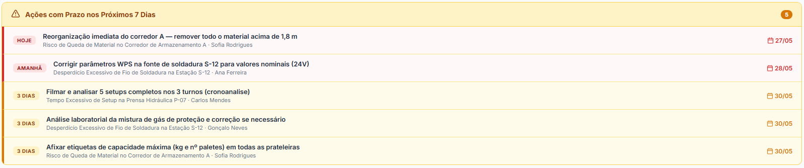
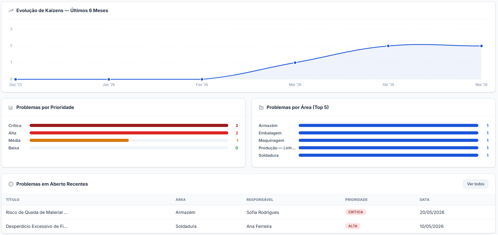
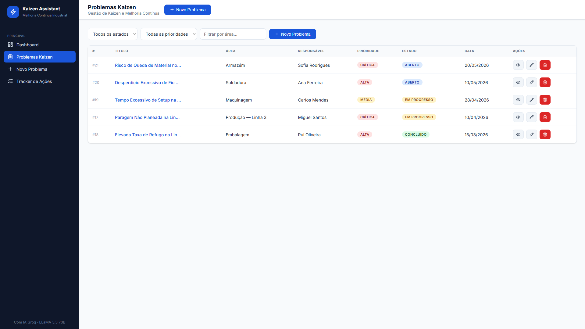
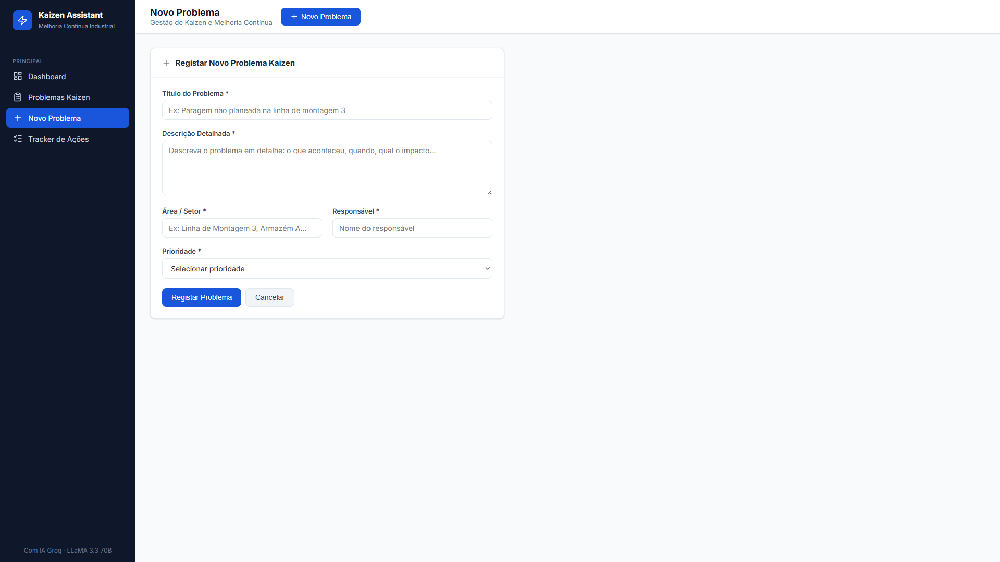
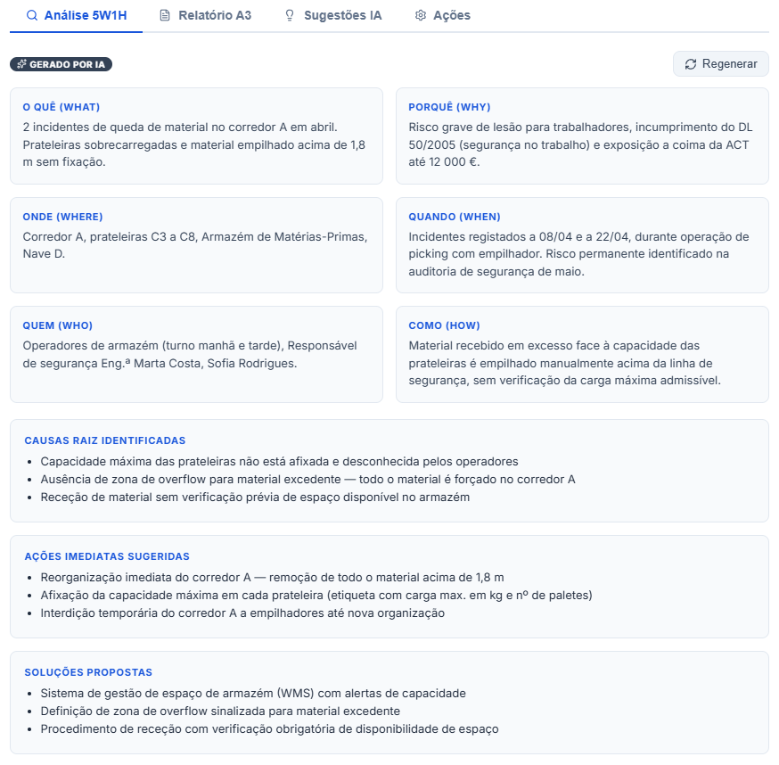
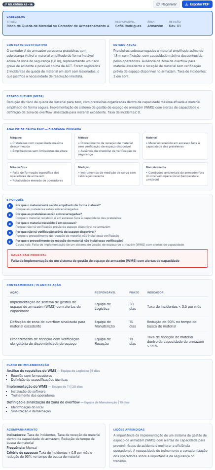
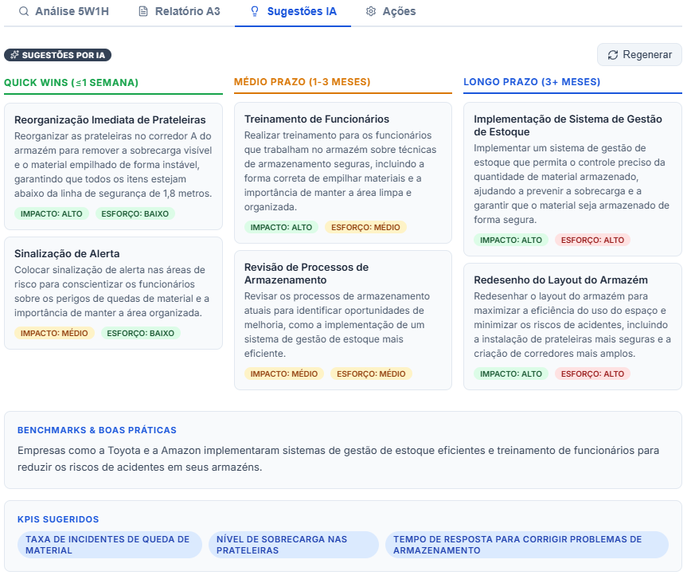
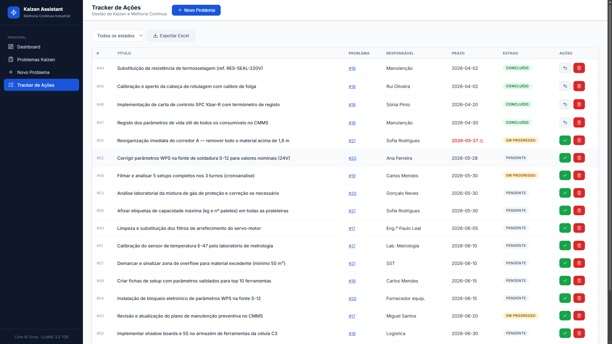
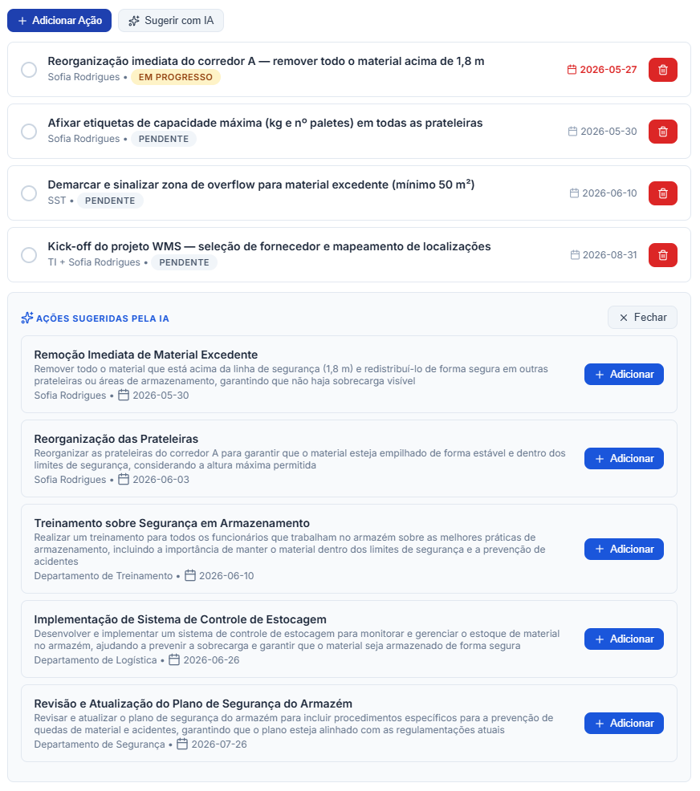

# ⚡ Kaizen Assistant — Gestão de Melhoria Contínua Industrial

> Aplicação web para gestão de Kaizen em ambiente industrial, com análise de problemas assistida por Inteligência Artificial (Groq · LLaMA 3.3 70B).


Projeto de portfólio desenvolvido no âmbito do curso de **Engenharia e Gestão Industrial (EGI)** na **FEUP**.

---

## Índice

- [Visão Geral](#visão-geral)
- [Screenshots](#screenshots)
- [Funcionalidades](#funcionalidades)
- [Stack Técnica](#stack-técnica)
- [Estrutura do Projeto](#estrutura-do-projeto)
- [Instalação e Execução](#instalação-e-execução)
- [API REST](#api-rest)
- [Dados de Exemplo](#dados-de-exemplo)
- [Autor](#autor)

---

## Visão Geral

O **Kaizen Assistant** é uma aplicação web single-page (SPA) que digitaliza o processo de melhoria contínua de uma unidade industrial. Permite registar e acompanhar problemas Kaizen, gerar análises estruturadas e relatórios profissionais com IA, e monitorizar as ações corretivas em tempo real.

**Destaques:**
- 🤖 IA integrada (Groq API, gratuita) para análise 5W1H, relatórios A3 e sugestões de melhoria
- 📊 Dashboard com KPIs em tempo real, gráficos de evolução e painel de alertas
- 📄 Exportação de relatório A3 para **PDF** e ações para **Excel** (.xlsx)
- 🗄️ Backend API REST em Python/Flask com base de dados SQLite local
- 🎨 Frontend SPA em HTML/CSS/JS puro, sem frameworks

---

## Screenshots

### Dashboard Principal



---

### Painel de Alertas de Ações Urgentes



---

### Gráficos de Análise do Dashboard



---

### Lista de Problemas Kaizen



---

### Registo de Novo Problema



---

### Análise 5W1H Gerada por IA



---

### Relatório A3 Completo



---

### Sugestões de Melhoria por IA



---

### Tracker de Ações



---

### Ações Sugeridas por IA (dentro do Detalhe)



---

## Funcionalidades

### 📊 Dashboard Inteligente
- **7 KPI cards** em tempo real: Total Kaizens, Em Aberto, Em Progresso, Concluídos, Taxa de Conclusão, Total de Ações, Ações Atrasadas
- **Gráfico de evolução** (Chart.js): kaizens registados por mês nos últimos 6 meses
- **Painel de alertas**: ações com deadline nos próximos 7 dias, classificadas por urgência (Hoje / Amanhã / X dias) com código de cor
- **Gráfico por prioridade**: distribuição de problemas por nível de criticidade
- **Gráfico por área**: Top 5 áreas com mais problemas

### 📋 Gestão de Problemas Kaizen
- Registo com campos: título, descrição, área/setor, responsável e prioridade (Baixa/Média/Alta/Crítica)
- Tabela com filtros por estado, prioridade e área
- Estados: Aberto → Em Progresso → Concluído / Cancelado
- Edição e eliminação com confirmação

### 🤖 Análise Assistida por IA (Groq · LLaMA 3.3 70B)

| Funcionalidade | Descrição |
|---|---|
| **Análise 5W1H** | Preenche automaticamente What/Why/Where/When/Who/How com causas raiz e ações imediatas |
| **Relatório A3** | Gera o A3 completo: contexto, Ishikawa (6M), 5 Porquês, contramedidas, plano de implementação, acompanhamento e lições aprendidas |
| **Sugestões de melhoria** | Quick wins, ações de médio e longo prazo com análise impacto/esforço, benchmarks e KPIs sugeridos |
| **Sugestões de ações** | Lista de ações corretivas priorizadas com responsável e prazo sugerido em dias |

### ⚙️ Tracker de Ações
- Criação manual de ações associadas a problemas (título, responsável, deadline)
- Toggle rápido concluída/pendente
- Deteção automática de ações atrasadas (highlight vermelho)
- Filtro por estado na vista global
- **Exportação para Excel** (.xlsx) via openpyxl com colunas: Problema, Ação, Responsável, Deadline, Estado, Prioridade

### 📄 Exportação Profissional
- **PDF do Relatório A3** gerado client-side com jsPDF (layout multi-página, cores por secção, tabela de contramedidas, rodapé com paginação)
- **Excel das Ações** gerado server-side com openpyxl (cabeçalhos formatados, colunas auto-ajustadas)

---

## Stack Técnica

| Camada | Tecnologia | Versão |
|--------|-----------|--------|
| **Backend** | Python + Flask | 3.9+ / 3.0.3 |
| **Base de dados** | SQLite (local, sem servidor) | — |
| **Frontend** | HTML + CSS + JavaScript puro | ES6+ |
| **IA** | Groq API · LLaMA 3.3 70B Versatile | Gratuita |
| **Gráficos** | Chart.js | 4.4.4 |
| **Ícones** | Lucide Icons | — |
| **PDF (client)** | jsPDF + jsPDF-AutoTable | 2.5.1 / 3.8.2 |
| **Excel (server)** | openpyxl | 3.1.5 |
| **CORS** | flask-cors | 4.0.1 |

> A Groq API tem tier gratuito generoso e não requer cartão de crédito.

### Arquitetura Frontend

O frontend está organizado em módulos ES com separação clara de responsabilidades e sem dependências circulares:

- **api.js** centraliza todos os `fetch()` com tratamento de erros consistente
- **ui.js** expõe utilitários partilhados (toasts, modais, renderização de ícones, formatadores)
- Os módulos de funcionalidade importam apenas de `api` e `ui`
- **main.js** orquestra a navegação e o tratamento de eventos via delegação (`data-action` / `data-nav`)

---

## Estrutura do Projeto

```
kaizen-assistant/
├── app.py              # Servidor Flask — API REST completa
├── database.py         # Modelos, operações CRUD e seed data
├── ai_service.py       # Integração com Groq API (5W1H, A3, sugestões)
├── requirements.txt    # Dependências Python
├── .env.example        # Template de configuração
├── kaizen.db           # Base de dados SQLite (gerada automaticamente)
└── static/
    ├── index.html      # SPA — estrutura HTML, views e modais
    ├── css/
    │   └── style.css   # Estilos (design system, componentes, responsivo)
    └── js/
        ├── api.js          # Camada de comunicação com a REST API
        ├── ui.js           # Componentes partilhados (toasts, modais, formatadores, ícones SVG)
        ├── dashboard.js    # KPIs, gráficos e painel de alertas
        ├── problems.js     # Gestão de problemas e análise IA
        ├── actions.js      # Tracker de ações e exportação
        └── main.js         # Ponto de entrada, navegação e delegação de eventos
```

---

## Instalação e Execução

### Pré-requisitos

- Python 3.9 ou superior
- Chave de API Groq gratuita — obter em [console.groq.com](https://console.groq.com)

### Passos

```bash
# 1. Clonar o repositório
git clone https://github.com/<utilizador>/kaizen-assistant.git
cd kaizen-assistant

# 2. Criar e ativar ambiente virtual
python -m venv venv

# Windows
venv\Scripts\activate
# macOS / Linux
source venv/bin/activate

# 3. Instalar dependências
pip install -r requirements.txt

# 4. Configurar variáveis de ambiente
cp .env.example .env        # macOS/Linux
copy .env.example .env      # Windows
```

Editar o ficheiro `.env` e preencher:

```env
GROQ_API_KEY=gsk_xxxxxxxxxxxxxxxxxxxx
```

```bash
# 5. Iniciar o servidor
python app.py
```

Abrir o browser em **[http://localhost:5000](http://localhost:5000)**.

> A base de dados `kaizen.db` é criada automaticamente na primeira execução.  
> No dashboard, clique em **"🏭 Carregar Dados de Exemplo"** (aparece apenas com a base de dados vazia) para popular com 5 problemas industriais realistas.

### Obter Chave Groq (2 minutos)

1. Aceder a [console.groq.com](https://console.groq.com) e criar conta gratuita
2. Menu lateral → **API Keys** → **Create API Key**
3. Copiar a chave para o campo `GROQ_API_KEY` no `.env`

---

## API REST

### KPIs e Estatísticas

| Método | Endpoint | Descrição |
|--------|----------|-----------|
| `GET` | `/api/kpis` | KPIs do dashboard (totais, taxas, distribuição por prioridade/área) |
| `GET` | `/api/stats/monthly` | Contagem de problemas por mês (`?months=6`) |

### Problemas

| Método | Endpoint | Descrição |
|--------|----------|-----------|
| `GET` | `/api/problems` | Listar problemas (`?status=`, `?priority=`, `?area=`) |
| `POST` | `/api/problems` | Criar problema |
| `GET` | `/api/problems/:id` | Obter problema |
| `PUT` | `/api/problems/:id` | Atualizar problema |
| `DELETE` | `/api/problems/:id` | Eliminar problema |
| `POST` | `/api/problems/:id/analyze` | Gerar análise 5W1H com IA |
| `POST` | `/api/problems/:id/a3` | Gerar relatório A3 com IA |
| `POST` | `/api/problems/:id/suggestions` | Gerar sugestões de melhoria com IA |
| `POST` | `/api/problems/:id/suggest_actions` | Gerar ações corretivas com IA |

### Ações

| Método | Endpoint | Descrição |
|--------|----------|-----------|
| `GET` | `/api/actions` | Listar ações (`?problem_id=`, `?status=`) |
| `GET` | `/api/actions/upcoming` | Ações com deadline próximo (`?days=7`) |
| `GET` | `/api/actions/export` | Exportar para Excel (`?status=`) |
| `POST` | `/api/actions` | Criar ação |
| `GET` | `/api/actions/:id` | Obter ação |
| `PUT` | `/api/actions/:id` | Atualizar ação |
| `DELETE` | `/api/actions/:id` | Eliminar ação |

### Utilitários

| Método | Endpoint | Descrição |
|--------|----------|-----------|
| `POST` | `/api/seed` | Popular DB com dados de exemplo (só funciona com DB vazia) |

---

## Dados de Exemplo

O endpoint `/api/seed` (acessível pelo botão no dashboard) popula a base de dados com **5 problemas industriais realistas**, cada um com análise 5W1H, relatório A3 e ações associadas completos, prontos para demonstração:

| # | Problema | Área | Prioridade | Estado |
|---|----------|------|-----------|--------|
| 1 | Paragem não planeada na Linha de Montagem 3 | Produção | 🟣 Crítica | Em Progresso |
| 2 | Elevada taxa de refugo na Linha de Embalagem LE-04 | Embalagem | 🔴 Alta | Concluído |
| 3 | Tempo excessivo de setup na Prensa Hidráulica P-07 | Maquinagem | 🟡 Média | Em Progresso |
| 4 | Desperdício de fio de soldadura na Estação S-12 | Soldadura | 🔴 Alta | Aberto |
| 5 | Risco de queda de material no Corredor de Armazenamento A | Armazém | 🟣 Crítica | Aberto |

---

## Autor

**João Rocha**  
Estudante de Engenharia e Gestão Industrial — FEUP  

---

*Projeto desenvolvido para fins académicos e de demonstração de portfólio.*
